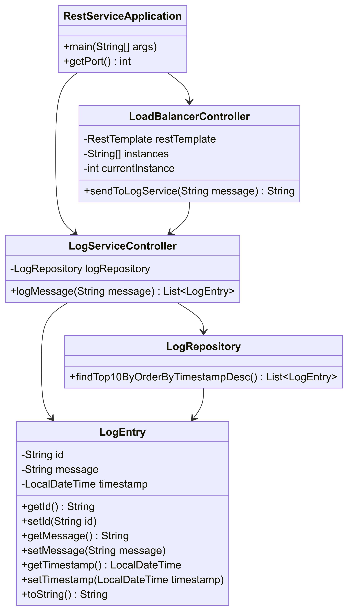
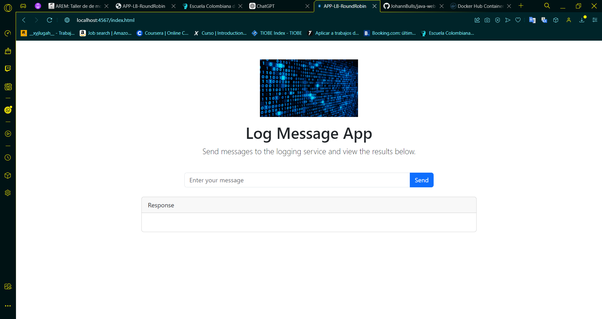
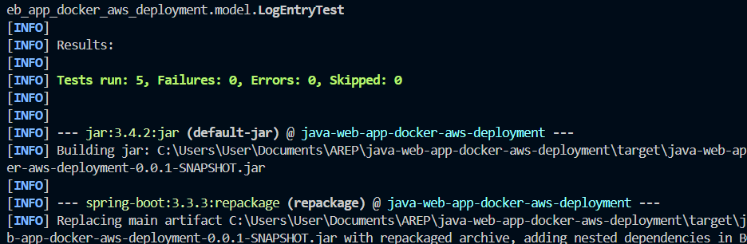

# AWS Docker Web Application Workshop

This workshop dives into the concepts of modularization through virtualization using Docker and AWS. You will create a small web application using Spark Java, Docker, and AWS. The application will be containerized, uploaded to DockerHub, and deployed on an AWS EC2 instance.

## Key Features

- **Web Application**: A simple web app created with Spring Boot that greets users through the `/greeting` endpoint.
- **Docker**: Containerize the application using Docker, build an image, and deploy it locally and in the cloud.
- **DockerHub**: Push the Docker image to a DockerHub repository.
- **AWS EC2**: Deploy the containerized application on an AWS EC2 instance.
- **Load Balancing**: The web app uses a Round Robin load-balancing algorithm to distribute messages to multiple instances of `LogService`.
- **MongoDB Service**: MongoDB runs in a Docker container and stores log entries submitted by the web app.

## Project Structure

### Main Classes

1. **HelloRestController**:
   - Simple REST controller providing a greeting message via the `/greeting` endpoint.
   - Accepts an optional query parameter `name` and returns a personalized greeting.

2. **LoadBalancerController**:
   - REST controller that distributes log messages across three instances of a log service using round-robin load balancing.
   - Provides a `/submit` endpoint for submitting log messages.

3. **LogServiceController**:
   - REST controller responsible for storing log messages in MongoDB.
   - The `/log` endpoint stores a log message and returns the 10 most recent log entries.

4. **LogEntry**:
   - Represents a log message stored in MongoDB, including fields for `id`, `message`, and `timestamp`.

5. **LogRepository**:
   - MongoDB repository interface for managing log entries.
   - Includes a custom query to retrieve the top 10 most recent log entries.

6. **RestServiceApplication**:
   - Main entry point for the Spring Boot application.
   - Configures the server to run on port 4567 or the port specified by the `PORT` environment variable.

### Test Classes

- **HelloRestControllerTest**:
  - Verifies that the `/greeting` endpoint returns the correct greeting message.
  - Tests with and without the `name` parameter.

- **LoadBalancerControllerTest**:
  - Tests the load balancing mechanism for distributing log messages across different instances.
  - Simulates the round-robin behavior and checks that messages are sent to the correct instances.

- **LogServiceControllerTest**:
  - Tests the `/log` endpoint to ensure that messages are correctly stored in MongoDB.
  - Verifies that the 10 most recent log entries are returned after submission.

- **LogEntryTest**:
  - Tests the creation of `LogEntry` objects and ensures that the `message` and `timestamp` fields are correctly set.

- **RestServiceApplicationTest**:
  - Ensures that the Spring Boot application starts correctly.
  - Verifies that the port is set correctly, either from the environment or defaulting to 4567.

## Project Configuration

- **Name**: LogService API
- **Description**: REST API for logging messages and load balancing across multiple log service instances.
- **Version**: 0.0.1-SNAPSHOT

### Dependencies

- **Spring Boot Starter Web**: For building the web application.
- **Spring Boot Starter Data MongoDB**: For MongoDB integration.
- **Spring Boot Starter Test**: For unit testing.
- **JUnit 5**: For unit testing.
- **MockMvc**: For web layer integration testing.



## Installation and Execution

### Prerequisites

- Java Development Kit (JDK) 17 or higher
- MongoDB running locally or in a Docker container

### Installation Steps

1. **Clone the Repository**:

   ```bash
   git clone https://github.com/JohannBulls/java-web-app-docker-aws-deployment.git
   cd java-web-app-docker-aws-deployment
   ```

2. **Compile the Project**:

   ```bash
   mvn clean install
   ```

3. **Run the Application**:

   ```bash
   mvn spring-boot:run
   ```



4. **Access the Application**:
   - Open your web browser and go to `http://localhost:4567/greeting`.
   - You can also access the `/submit` endpoint to test the load balancing or `/log` to submit a log message.

### Running Tests

To run the unit tests, make sure JUnit and the testing dependencies are set up. Then, execute the following commands:

1. **Compile the Tests**:

   ```bash
   mvn clean install
   ```

2. **Run the Tests**:

   ```bash
   mvn test
   ```

   

## Technologies Used

- **Java**: Primary programming language.
- **Spring Boot**: Framework for developing Java applications.
- **MongoDB**: NoSQL database for storing log entries.
- **JUnit 5**: For unit testing.
- **MockMvc**: For web layer integration testing.

## Author

- Johann Amaya - *JohannBulls* - [GitHub](https://github.com/JohannBulls)

## License

This project is licensed under the MIT License. See the [LICENSE](LICENSE.txt) file for details.
